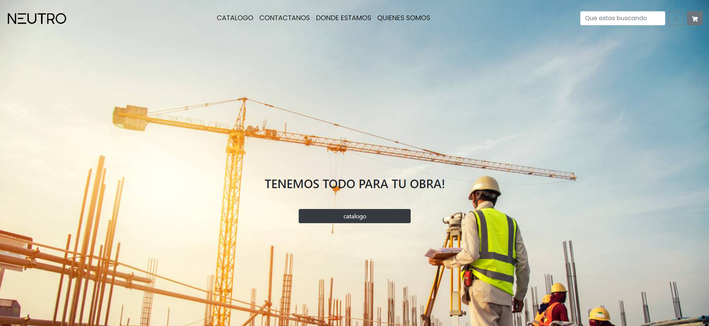

# Tienda online de alquiler de herramientas y maquinas

Este proyecto sera una tienda en donde se pueda realizar la solicitud y pago de una herramienta o maquina durante cierta cantidad de tiempo.

## Estado del proyecto

Actualmente el proyecto se encuentra en desarrollo del minimo viable en donde solo se ah dispuesto como compra de maquinas. Se agregaran: tiempo de alquiler, filtros en la busqueda de herramientras en donde se separe por categorias y el proceso de compras en el carrito.

### Tecnologias utilizadas

El sitio fue realizado en react.js (https://es.reactjs.org/), los estilos fueron realizados con la libreria de bootstrap (https://getbootstrap.com/) y css.

### Guia de instalación de proyecto
```
$ git clone https://github.com/Julian-Magallanes/Alquiler-de-herramientas---Julian-Magallanes.git
$ cd ../path/to/the/file
$ npm install
$ npm start
```
El home del proyecto se debe ver asi
</img>

### Finalidad del proyecto

Este es el proyecto final para la implementacion de la tecnologia de react.js de la carrera de frontend de coderhouse (https://www.coderhouse.com/).
